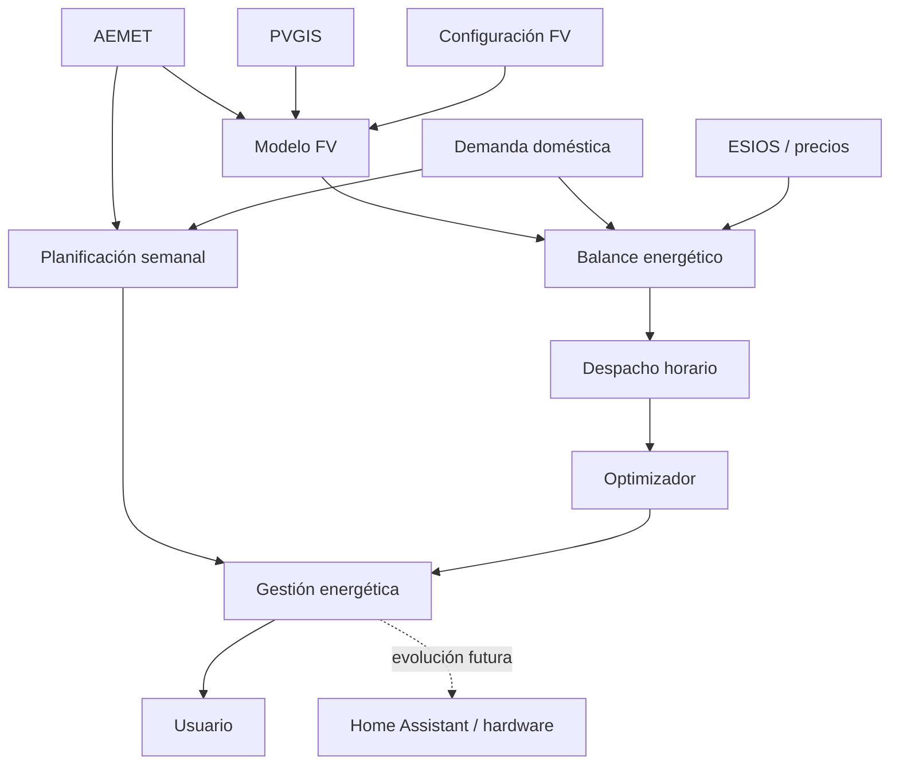
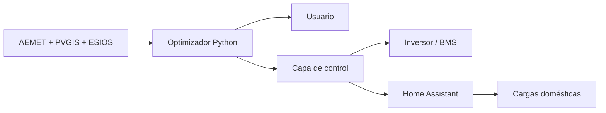
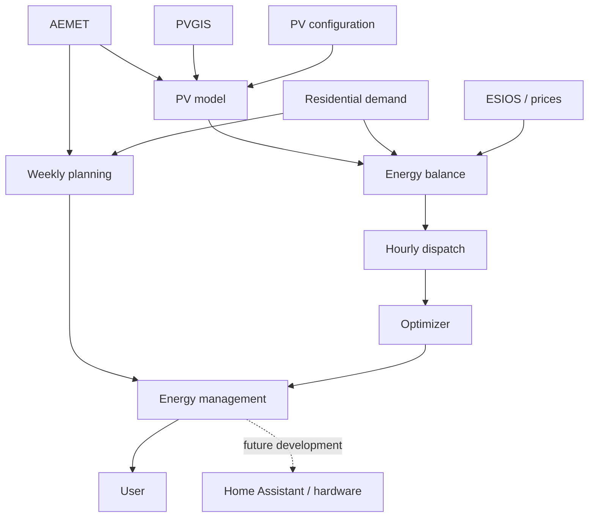
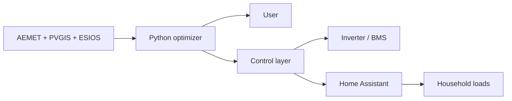

<div align="center">

# ☀️ Gestión Solar Predictiva
## Predictive Solar Energy Management

**AEMET · PVGIS · ESIOS · Photovoltaics · Battery · Flexible Demand · Weekly Planning**

[🇪🇸 Español](#-español) · [🇬🇧 English](#-english)

[](https://www.python.org/)
[](LICENSE)
[](#estado-del-proyecto)
[](docs/ARCHITECTURE.md)

**From weather forecasts to reproducible residential energy management.**

</div>

---

# 🇪🇸 Español

## ☀️ ¿Qué es Gestión Solar Predictiva?

**Gestión Solar Predictiva** es un sistema experimental desarrollado en Python para transformar previsiones meteorológicas, referencias solares, precios de electricidad y un modelo de demanda doméstica en **decisiones energéticas horarias y semanales**.

El proyecto no pretende únicamente predecir cuánta electricidad producirán los paneles fotovoltaicos. Su objetivo es responder a dos preguntas operativas:

> **¿Qué debe hacer la instalación en cada hora?**  
> Autoconsumir, cargar la batería, descargarla, comprar electricidad o exportar excedentes.

> **¿Cuándo conviene prestar cada servicio durante la semana?**  
> Desplazar cargas, climatizar la vivienda, producir ACS, regar o aprovechar recursos solares alternativos.

Para ello combina:

- **AEMET OpenData** — previsión meteorológica diaria y horaria;
- **PVGIS** — referencia solar y climatológica;
- **ESIOS** — información económica y precios eléctricos;
- un modelo físico-predictivo de generación fotovoltaica;
- un modelo horario de demanda doméstica;
- almacenamiento electroquímico;
- almacenamiento térmico;
- cargas flexibles;
- planificación semanal;
- y un algoritmo de despacho energético.

El objetivo no es únicamente minimizar el coste eléctrico instantáneo. La estrategia también intenta:

- aumentar el autoconsumo;
- desplazar consumos hacia las mejores horas solares;
- preservar la vida útil de la batería;
- evitar ciclos electroquímicos de escaso valor;
- aprovechar el almacenamiento térmico;
- anticipar decisiones mediante previsión meteorológica;
- coordinar la planificación semanal con el despacho horario.

---

## 🎯 Las dos escalas del problema

El sistema trabaja actualmente en dos escalas temporales complementarias:

```text
PLANIFICACIÓN SEMANAL
weekly.py
       │
       │ ¿Cuándo conviene prestar cada servicio?
       ▼
lavadora · horno · climatización · ACS · riego · cocina solar

                         ↓

DESPACHO HORARIO
dispatch.py
       │
       │ ¿De dónde debe proceder la energía?
       ▼
FV · batería · red · compra · venta
```

La planificación semanal determina **cuándo es conveniente consumir**.

El despacho horario determina **cómo debe suministrarse esa energía**.

La evolución del proyecto pretende acoplar progresivamente ambos niveles.

---

## 🧠 Filosofía de operación

La estrategia `sostenible_predictiva` sigue aproximadamente esta jerarquía:

```text
Necesidad doméstica
        ↓
Autoconsumo FV directo
        ↓
Desplazamiento de cargas
        ↓
Almacenamiento térmico
        ↓
Batería, cuando su utilización esté justificada
        ↓
Compra / venta de red
```

Un principio central del proyecto es:

> **La energía almacenada en la batería no se considera gratuita.**

La utilización de la batería implica pérdidas de conversión, envejecimiento y consumo de vida útil.

Por ello, una pequeña compra de electricidad puede resultar preferible a realizar un ciclo de batería cuyo beneficio energético o económico sea marginal.

---

## 🌦️ Fuentes de datos

### AEMET OpenData

AEMET proporciona información meteorológica utilizada para:

- temperatura;
- nubosidad;
- precipitación;
- estado del cielo;
- corrección meteorológica de la producción FV;
- planificación térmica.

El sistema utiliza un enfoque multirresolución:

```text
primeras ~48 h   → AEMET horario
resto de semana  → AEMET diario
```

### PVGIS

PVGIS proporciona la referencia solar y climatológica utilizada por el modelo fotovoltaico.

Conceptualmente:

```math
G_{\mathrm{pred}}(t)
=
G_{\mathrm{PVGIS}}(t)
F_{\mathrm{met}}(t)
```

donde `Fmet` representa la corrección asociada a la meteorología prevista.

### ESIOS

ESIOS proporciona información económica utilizada para construir:

- precios horarios de compra;
- precios de compensación o exportación;
- criterios económicos de utilización de batería y red.

---

## ⚡ Flujo de decisión



La predicción meteorológica se transforma así en una **propuesta de operación reproducible**, no únicamente en una estimación de generación.

---

## 🏠 Instalación de referencia

| Elemento | Configuración |
|---|---:|
| Paneles FV | 10 |
| Potencia instalada | 6.05 kWp |
| Inversor | Deye SUN-6K-SG05LP1-EU-AM2-P |
| Potencia nominal | 6.00 kW |
| Baterías | 2 × SE-G5.1 Pro-B |
| Energía nominal | 10.24 kWh |
| SOC operativo normal | 20–85 % |
| Ventana sostenible | 6.656 kWh |

Estos valores corresponden únicamente a la instalación utilizada como referencia y podrán sustituirse por los parámetros de otra instalación mediante la configuración del sistema. El asistente `installation/wizard.py` permite realizar esta adaptación sin editar manualmente los módulos Python.

---

## 📚 Documentación técnica

El desarrollo matemático, los algoritmos y el protocolo experimental se mantienen separados del README:

| Documento | Contenido |
|---|---|
| 📐 [**MODEL.md**](docs/MODEL.md) | Modelo físico, energético y matemático |
| 🔋 [**DISPATCH.md**](docs/DISPATCH.md) | Batería, SOC, compra, venta y despacho horario |
| 📅 [**WEEKLY.md**](docs/WEEKLY.md) | Planificación semanal, cargas flexibles y gestión térmica |
| 🧪 [**VALIDATION.md**](docs/VALIDATION.md) | Metodología de validación experimental |
| 🏗️ [**ARCHITECTURE.md**](docs/ARCHITECTURE.md) | Arquitectura software y evolución hacia control real |
| ⚙️ [**INSTALLATION.md**](docs/INSTALLATION.md) | Instalación, APIs, credenciales y puesta en marcha |

---

## 🧩 Módulos principales

| Archivo | Responsabilidad |
|---|---|
| `config.yaml` | configuración persistente de la instalación |
| `installation/wizard.py` | asistente de configuración y generación de módulos |
| `config.py` | parámetros físicos generados a partir de `config.yaml` |
| `demand.py` | vivienda, cargas y demanda generadas/configuradas a partir de `config.yaml` |
| `aemet.py` | predicción meteorológica diaria |
| `aemet_hourly.py` | predicción meteorológica horaria |
| `solar.py` | modelo físico-predictivo FV |
| `esios.py` | precios eléctricos |
| `balance.py` | balance FV–demanda–precios |
| `dispatch.py` | batería, red, compra y venta |
| `optimizer.py` | estrategia sostenible-predictiva |
| `weekly.py` | planificación semanal de servicios |
| `main.py` | integración y presentación |

---

## 📅 Planificación semanal

`weekly.py` clasifica los servicios según su naturaleza física:

| Tipo | Ejemplos | Criterio principal |
|---|---|---|
| Tarea desplazable | lavadora, horno | presencia + solar + horario |
| Térmica | climatización | temperatura prevista |
| Condicional | termo eléctrico | necesidad real de ACS |
| Restricción externa | riego | criterios físicos/agronómicos |
| Alternativa solar | horno solar | disponibilidad solar |

La planificación responde a una idea sencilla:

> **No toda demanda tiene por qué producirse en el instante inicialmente previsto.**

Una parte del consumo puede desplazarse hacia horas o días energéticamente más favorables.

---

## 🔋 Despacho energético

Para cada intervalo debe satisfacerse aproximadamente:

```math
P_{\mathrm{FV}}
+
P_{\mathrm{buy}}
+
P_{\mathrm{dis}}
=
P_{\mathrm{load}}
+
P_{\mathrm{ch}}
+
P_{\mathrm{sell}}
```

A partir de este balance, el algoritmo decide entre:

```text
AUTOCONSUMIR
CARGAR_BATERIA
DESCARGAR_BATERIA
COMPRAR_RED
VENDER
```

La decisión depende no solo del balance instantáneo, sino también del SOC, de los límites operativos, de los precios y de las condiciones futuras previstas.

---

## 🧪 Estado del proyecto

El proyecto se encuentra actualmente en fase **experimental**.

Dispone de:

- predicción meteorológica diaria y horaria;
- modelo físico-predictivo de generación FV;
- perfil horario de demanda;
- precios eléctricos horarios;
- balance FV–demanda–red;
- despacho horario de batería;
- SOC objetivo predictivo;
- planificación semanal;
- gestión térmica basada en previsión de temperatura;
- cálculo de autoconsumo, autosuficiencia, compras, ventas y ciclos equivalentes.

La siguiente etapa fundamental es la:

> **validación experimental con datos reales de la instalación.**

Será necesario comparar sistemáticamente predicción y medida real para cuantificar el comportamiento del modelo.

---

## ⚙️ Instalación rápida

### Ubuntu / Debian — paquete `.deb`

Descarga una versión publicada del paquete y ejecuta:

```bash
sudo apt install ./gestion-solar-predictiva_VERSION_all.deb
gestion-solar-config
gestion-solar --soc 0.60
```

`sudo` se utiliza únicamente para instalar el paquete. `gestion-solar-config` y `gestion-solar` deben ejecutarse como usuario normal.

### Desde GitHub

```bash
git clone https://github.com/maxwellfree/Gestion-Solar-AEMET-ESIOS.git
cd Gestion-Solar-AEMET-ESIOS
chmod +x installation/install.sh
./installation/install.sh
```

El asistente solicita las credenciales de AEMET y ESIOS y permite configurar la instalación fotovoltaica, baterías, vivienda y cargas. La configuración persistente se guarda en `config.yaml`; a partir de ella se generan automáticamente `config.py` y `demand.py`.

Las instrucciones completas se encuentran en:

➡️ [**docs/INSTALLATION.md**](docs/INSTALLATION.md)

Ejecución básica desde una instalación `.deb`:

```bash
gestion-solar --soc 0.60
```

Ejecución básica desde el código fuente:

```bash
python3 main.py --soc 0.60
```

Ejecución detallada:

```bash
python3 main.py \
    --soc 0.60 \
    --mostrar-semanal \
    --mostrar-precios \
    --mostrar-solar \
    --mostrar-balance \
    --mostrar-plan-horario
```

Planificación semanal independiente:

```bash
python3 weekly.py
```

---

## 🚀 Evolución prevista

La arquitectura está diseñada para poder evolucionar hacia un **Home Energy Management System (HEMS)**.



Una futura implementación podría:

- avisar del mejor momento para poner la lavadora;
- recomendar cuándo utilizar el horno solar;
- planificar la producción de ACS;
- anticipar climatización;
- conservar SOC antes de días de baja producción;
- modificar consignas compatibles del inversor;
- decidir cuándo comprar o exportar electricidad;
- automatizar determinadas cargas mediante Home Assistant;
- explicar al usuario por qué se ha tomado cada decisión.

La capa de optimización debe permanecer separada de la capa física de control.

---

## ⚠️ Seguridad

Este software es experimental.

No sustituye:

- las protecciones eléctricas;
- el BMS;
- los límites internos del inversor;
- las protecciones AC/DC;
- los mecanismos de seguridad establecidos por el fabricante.

Cualquier futura conexión automática con hardware deberá incorporar validación independiente de consignas, gestión de errores y un estado seguro de respaldo.

---

## 📄 Licencia

Este proyecto se distribuye bajo la [**MIT License**](LICENSE).

---

# 🇬🇧 English

## ☀️ What is Predictive Solar Energy Management?

**Predictive Solar Energy Management** is an experimental Python system that transforms weather forecasts, solar-resource data, electricity prices and a residential demand model into **hourly and weekly energy-management decisions**.

The project does not merely attempt to predict photovoltaic generation. It addresses two operational questions:

> **What should the energy system do during each hour?**  
> Self-consume PV energy, charge the battery, discharge it, import electricity or export surplus energy.

> **When should each household service preferably be operated during the week?**  
> Shift flexible loads, operate HVAC, produce domestic hot water, irrigate or use alternative solar resources.

The system combines:

- **AEMET OpenData** — daily and hourly weather forecasts;
- **PVGIS** — solar and climatological reference data;
- **ESIOS** — electricity-market and economic information;
- a physics-based predictive PV model;
- an hourly residential demand model;
- electrochemical storage;
- thermal storage;
- flexible loads;
- weekly scheduling;
- and an energy-dispatch algorithm.

The objective is not simply to minimize instantaneous electricity costs. The strategy also seeks to:

- increase direct PV self-consumption;
- shift consumption towards favourable solar periods;
- preserve battery lifetime;
- avoid low-value battery cycling;
- exploit thermal storage;
- anticipate decisions using weather forecasts;
- coordinate weekly planning with hourly dispatch.

---

## 🎯 Two complementary time scales

The system currently operates at two complementary time scales:

```text
WEEKLY PLANNING
weekly.py
       │
       │ When should each service operate?
       ▼
washing · cooking · HVAC · DHW · irrigation · solar cooking

                         ↓

HOURLY DISPATCH
dispatch.py
       │
       │ Where should the energy come from?
       ▼
PV · battery · grid · import · export
```

Weekly planning determines **when energy should preferably be consumed**.

Hourly dispatch determines **how that energy should be supplied**.

Future development will progressively couple both levels.

---

## 🧠 Operating philosophy

The `sostenible_predictiva` strategy approximately follows this hierarchy:

```text
Household energy requirement
        ↓
Direct PV self-consumption
        ↓
Flexible-load shifting
        ↓
Thermal storage
        ↓
Battery, when justified
        ↓
Grid import / export
```

A central principle is:

> **Energy stored in the battery is not considered free.**

Battery operation involves conversion losses, degradation and consumption of useful lifetime.

Consequently, a small electricity purchase may sometimes be preferable to a battery cycle providing only marginal energetic or economic value.

---

## 🌦️ Data sources

### AEMET OpenData

AEMET provides weather forecasts used for:

- temperature;
- cloud conditions;
- precipitation;
- sky conditions;
- meteorological correction of PV production;
- thermal-management planning.

A multiresolution approach is used:

```text
first ~48 h      → hourly AEMET forecast
rest of the week → daily AEMET forecast
```

### PVGIS

PVGIS provides the solar and climatological reference used by the photovoltaic model.

Conceptually:

```math
G_{\mathrm{pred}}(t)
=
G_{\mathrm{PVGIS}}(t)
F_{\mathrm{met}}(t)
```

where `Fmet` represents the correction associated with forecast weather conditions.

### ESIOS

ESIOS provides economic information used to construct:

- hourly import prices;
- export or surplus-compensation prices;
- economic criteria for battery and grid operation.

---

## ⚡ Decision flow



Weather prediction is therefore transformed into a **reproducible operational proposal**, rather than merely a generation forecast.

---

## 🏠 Reference installation

| Component | Configuration |
|---|---:|
| PV modules | 10 |
| Installed PV power | 6.05 kWp |
| Inverter | Deye SUN-6K-SG05LP1-EU-AM2-P |
| Rated inverter power | 6.00 kW |
| Batteries | 2 × SE-G5.1 Pro-B |
| Nominal energy | 10.24 kWh |
| Normal operating SOC | 20–85 % |
| Sustainable energy window | 6.656 kWh |

These parameters describe only the current reference installation and can be replaced by the parameters of another system through the project configuration. The `installation/wizard.py` assistant performs this adaptation without requiring manual edits to the Python modules.

---

## 📚 Technical documentation

Detailed mathematical models, algorithms and experimental-validation procedures are kept outside the README:

| Document | Contents |
|---|---|
| 📐 [**MODEL.md**](docs/MODEL.md) | Physical, energy and mathematical model |
| 🔋 [**DISPATCH.md**](docs/DISPATCH.md) | Battery, SOC, grid import/export and hourly dispatch |
| 📅 [**WEEKLY.md**](docs/WEEKLY.md) | Weekly scheduling, flexible loads and thermal management |
| 🧪 [**VALIDATION.md**](docs/VALIDATION.md) | Experimental validation methodology |
| 🏗️ [**ARCHITECTURE.md**](docs/ARCHITECTURE.md) | Software architecture and evolution towards real control |
| ⚙️ [**INSTALLATIONen.md**](docs/INSTALLATIONen.md) | Installation, APIs, credentials and setup |

---

## 🧩 Main modules

| File | Responsibility |
|---|---|
| `config.yaml` | persistent installation-specific configuration |
| `installation/wizard.py` | configuration assistant and module generator |
| `config.py` | physical parameters generated from `config.yaml` |
| `demand.py` | household loads and demand configuration generated from `config.yaml` |
| `aemet.py` | daily weather forecast |
| `aemet_hourly.py` | hourly weather forecast |
| `solar.py` | physics-based predictive PV model |
| `esios.py` | electricity prices |
| `balance.py` | PV–demand–price balance |
| `dispatch.py` | battery, grid, import and export |
| `optimizer.py` | sustainable predictive strategy |
| `weekly.py` | weekly service scheduling |
| `main.py` | integration and presentation |

---

## 📅 Weekly planning

`weekly.py` classifies services according to their physical nature:

| Type | Examples | Main criterion |
|---|---|---|
| Shiftable task | washing machine, oven | presence + solar + time |
| Thermal load | HVAC | forecast temperature |
| Conditional load | electric water heater | actual DHW requirement |
| External constraint | irrigation | physical/agronomic criteria |
| Solar alternative | solar oven | solar availability |

The underlying idea is:

> **Not all energy demand must occur at its initially expected time.**

Part of the demand can be shifted towards more favourable hours or days.

---

## 🔋 Energy dispatch

For every interval, the approximate balance must satisfy:

```math
P_{\mathrm{PV}}
+
P_{\mathrm{buy}}
+
P_{\mathrm{dis}}
=
P_{\mathrm{load}}
+
P_{\mathrm{ch}}
+
P_{\mathrm{sell}}
```

The algorithm subsequently decides between:

```text
SELF_CONSUME
CHARGE_BATTERY
DISCHARGE_BATTERY
IMPORT_GRID
EXPORT
```

The decision depends not only on the instantaneous balance but also on SOC, operational limits, electricity prices and expected future conditions.

---

## 🧪 Project status

The project is currently **experimental**.

The present implementation includes:

- daily and hourly weather forecasting;
- physics-based predictive PV generation;
- hourly residential demand;
- hourly electricity prices;
- PV–demand–grid balance;
- hourly battery dispatch;
- predictive target SOC;
- weekly service scheduling;
- forecast-based thermal management;
- calculation of self-consumption, self-sufficiency, imports, exports and equivalent battery cycles.

The next fundamental stage is:

> **experimental validation using real data from the reference installation.**

Predictions and real measurements must be systematically compared to quantify model performance.

---

## ⚙️ Quick installation

### Ubuntu / Debian — `.deb` package

Download a published package and run:

```bash
sudo apt install ./gestion-solar-predictiva_VERSION_all.deb
gestion-solar-config
gestion-solar --soc 0.60
```

`sudo` is required only to install the package. Run `gestion-solar-config` and `gestion-solar` as the normal user.

### From GitHub

```bash
git clone https://github.com/maxwellfree/Gestion-Solar-AEMET-ESIOS.git
cd Gestion-Solar-AEMET-ESIOS
chmod +x installation/install.sh
./installation/install.sh
```

The wizard requests the AEMET and ESIOS credentials and configures the PV installation, batteries, household and loads. Persistent configuration is stored in `config.yaml`; `config.py` and `demand.py` are then generated automatically.

Complete instructions are available in:

➡️ [**docs/INSTALLATIONen.md**](docs/INSTALLATIONen.md)

Basic execution with a `.deb` installation:

```bash
gestion-solar --soc 0.60
```

Basic execution from source:

```bash
python3 main.py --soc 0.60
```

Detailed execution:

```bash
python3 main.py \
    --soc 0.60 \
    --mostrar-semanal \
    --mostrar-precios \
    --mostrar-solar \
    --mostrar-balance \
    --mostrar-plan-horario
```

Independent weekly planning:

```bash
python3 weekly.py
```

---

## 🚀 Planned evolution

The architecture is intended to evolve towards a **Home Energy Management System (HEMS)**.



A future implementation could:

- notify the user of the best time to run the washing machine;
- recommend when to use solar cooking;
- schedule domestic hot water production;
- anticipate HVAC operation;
- preserve SOC before low-generation days;
- modify compatible inverter setpoints;
- decide when electricity should be imported or exported;
- automate selected loads through Home Assistant;
- explain each operational decision to the user.

The scientific optimization layer should remain separated from the physical control layer.

---

## ⚠️ Safety

This software is experimental.

It does not replace:

- electrical protection systems;
- the battery BMS;
- internal inverter limits;
- AC/DC protections;
- manufacturer safety mechanisms.

Any future automatic hardware connection should include independent setpoint validation, error handling and a safe fallback state.

---

## 📄 License

This project is distributed under the [**MIT License**](LICENSE).

---

## 👤 Author

**Enrique M. Moreno Pérez**

Experimental project on residential energy management, photovoltaic forecasting and sustainable predictive optimization.

---

<div align="center">

### AEMET + PVGIS + ESIOS + flexible demand + battery

**De la predicción meteorológica a la gestión energética doméstica.**  
**From weather forecasting to residential energy management.**

</div>
