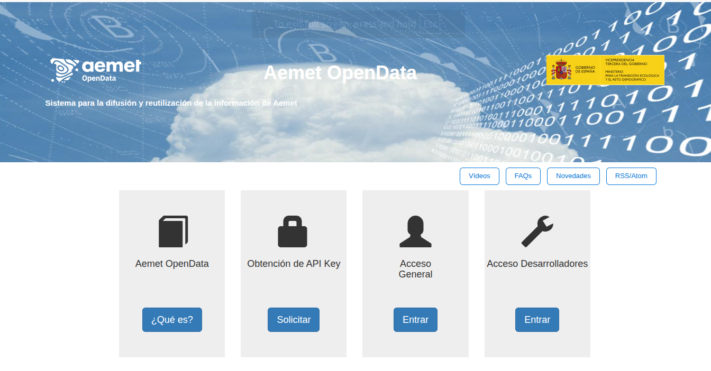
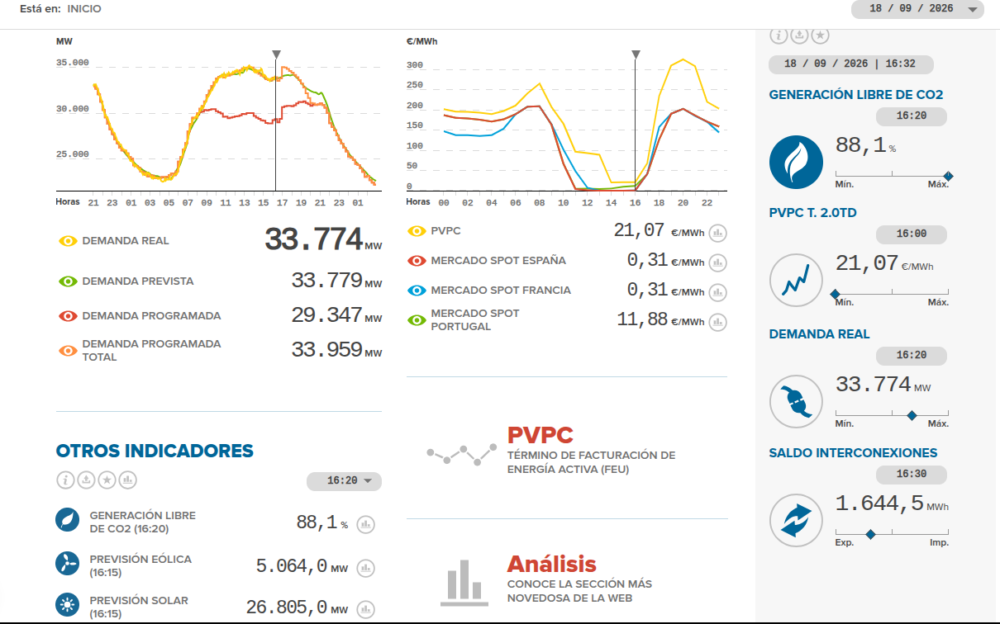

# Gestión Solar Predictiva --- Android

> **Rama de desarrollo:** `android-app`\
> **Objetivo:** proporcionar una aplicación Android instalable que
> configure y ejecute el motor Python existente de
> **Gestion-Solar-AEMET-ESIOS** y presente sus resultados de forma
> clara, visual y explicable.


## 1. Objetivo del proyecto Android

El proyecto existente ya contiene el núcleo de cálculo en Python. La
tarea de `android-app` no consiste en reproducir esos algoritmos en
Kotlin, sino en construir una capa móvil alrededor del motor existente.

La aplicación debe permitir que un usuario, sin editar código ni
archivos manualmente:

1.  introduzca sus credenciales de AEMET y ESIOS;
2.  configure su ubicación, instalación fotovoltaica, inversor, batería,
    vivienda y cargas;
3.  indique los datos variables necesarios para cada ejecución, como el
    estado de carga de la batería (SOC);
4.  ejecute el motor predictivo;
5.  reciba recomendaciones para **hoy** y para los próximos días;
6.  pueda entender **por qué** se recomienda cada acción.

La primera versión será deliberadamente un **sistema de recomendación**.
No enviará órdenes al inversor ni automatizará cargas domésticas.

------------------------------------------------------------------------

## 2. Principio arquitectónico

> **Android configura → Python calcula → Android presenta.**

La separación entre capas debe mantenerse durante todo el desarrollo:

``` text
┌─────────────────────────────────────────────┐
│              APLICACIÓN ANDROID             │
│        Kotlin + Jetpack Compose             │
│                                             │
│  configuración · credenciales · SOC · UI    │
└──────────────────────┬──────────────────────┘
                       │
                       ▼
┌─────────────────────────────────────────────┐
│           ADAPTADOR ANDROID ↔ PYTHON        │
│                                             │
│  entrada estructurada → run_plan(...)       │
│  salida estructurada  ← dict / JSON         │
└──────────────────────┬──────────────────────┘
                       │
                       ▼
┌─────────────────────────────────────────────┐
│              MOTOR PYTHON EXISTENTE         │
│                                             │
│  AEMET · PVGIS · ESIOS · demanda · balance  │
│  batería · optimización · planificación     │
└──────────────────────┬──────────────────────┘
                       │
                       ▼
┌─────────────────────────────────────────────┐
│             RESULTADOS PARA ANDROID         │
│                                             │
│  hoy · semana · energía · explicaciones     │
└─────────────────────────────────────────────┘
```

La regla de diseño es:

**UI ≠ algoritmo ≠ acceso a datos**

Los algoritmos físicos y energéticos no deben terminar dispersos entre
pantallas, `ViewModel` o componentes Compose.

------------------------------------------------------------------------

## 3. Documentación del desarrollador

Este `README.md` es el punto de entrada. La especificación se divide en
documentos más concretos:

  -------------------------------------------------------------------------------------------------------------------------------
  Documento                                                                       Qué contiene            Cuándo consultarlo
  ------------------------------------------------------------------------------- ----------------------- -----------------------
  **[ARCHITECTURE.md](docs/ARCHITECTURE.md)**                                     Arquitectura            Antes de implementar la
                                                                                  Android--Python,        integración
                                                                                  responsabilidades y     
                                                                                  contrato del adaptador  

  **[CONFIGURATION_AND_CREDENTIALS.md](docs/CONFIGURATION_AND_CREDENTIALS.md)**   Onboarding,             Al desarrollar
                                                                                  configuración de        formularios y
                                                                                  instalación y           persistencia
                                                                                  tratamiento de secretos 

  **[DATA_SOURCES.md](docs/DATA_SOURCES.md)**                                     AEMET, PVGIS, ESIOS y   Al conectar el motor
                                                                                  política de caché       con datos reales

  **[UI_MVP.md](docs/UI_MVP.md)**                                                 Pantallas, navegación,  Al desarrollar la
                                                                                  recomendaciones y       interfaz
                                                                                  explicabilidad          

  **[DEVELOPMENT_PLAN.md](docs/DEVELOPMENT_PLAN.md)**                             Fases, entregables y    Para organizar el
                                                                                  criterios de            trabajo
                                                                                  finalización            
  -------------------------------------------------------------------------------------------------------------------------------

### Ruta de lectura recomendada

``` text
README.md
    ↓
ARCHITECTURE.md
    ↓
CONFIGURATION_AND_CREDENTIALS.md
    ↓
DATA_SOURCES.md
    ↓
UI_MVP.md
    ↓
DEVELOPMENT_PLAN.md
```

------------------------------------------------------------------------

## 4. Componentes Python que se pretende reutilizar

La documentación actual identifica los siguientes módulos como parte del
motor existente.

### Acceso a datos

``` text
aemet.py
aemet_hourly.py
solar.py
esios.py
cache.py
```

Responsabilidades previstas:

``` text
aemet.py / aemet_hourly.py  → meteorología
solar.py                    → producción fotovoltaica / PVGIS
esios.py                    → precios y datos del sistema eléctrico
cache.py                    → caché local
```

### Cálculo y planificación

``` text
balance.py
dispatch.py
optimizer.py
weekly.py
```

Responsabilidades previstas:

``` text
balance.py    → balance energético
dispatch.py   → gestión de batería y red
optimizer.py  → optimización
weekly.py     → planificación semanal
```

### Configuración y demanda

``` text
config.yaml
config.py
demand.py
```

La interfaz Android debe recopilar la información del usuario y
transformarla al formato que necesite el motor. No debe obligarse al
usuario final a editar `config.yaml` o `demand.py` manualmente.

------------------------------------------------------------------------

## 5. Contrato Android ↔ Python

Una prioridad temprana del desarrollo es disponer de una entrada
programática estable al motor.

No se debe ejecutar `main.py` y después intentar interpretar texto
impreso en consola. La interfaz debe recibir datos estructurados.

La forma conceptual propuesta es:

``` python
def run_plan(config, soc, refresh=False):
    ...
    return result
```

También podría utilizarse una ruta de configuración:

``` python
def run_plan(config_path, soc, refresh=False):
    ...
    return result
```

La decisión concreta debe tomarse durante la fase de integración y, una
vez fijada, mantenerse como contrato estable.

### Entrada mínima prevista

``` python
{
    "config": "...",      # objeto o ruta, según el contrato definitivo
    "soc": 0.65,         # 0.0 ... 1.0
    "refresh": False
}
```

### Salida conceptual

``` json
{
  "status": "ok",
  "warnings": [],
  "updated_at": "2026-09-21T10:30:00",
  "cache_status": "valid",
  "forecast": {},
  "demand": {},
  "energy": {},
  "today_actions": [],
  "weekly_plan": []
}
```

El esquema anterior es **orientativo**: la estructura definitiva debe
derivarse de los datos que realmente produzca el motor Python. No
conviene inventar campos en Kotlin que el motor todavía no pueda
proporcionar.

------------------------------------------------------------------------

## 6. Fuentes externas

El motor utiliza tres familias principales de información externa.

### AEMET OpenData

Proporciona la información meteorológica necesaria para la predicción.



La aplicación debe permitir introducir la API Key obtenida por el
usuario. El proceso de configuración se documenta en
[CONFIGURATION_AND_CREDENTIALS.md](docs/CONFIGURATION_AND_CREDENTIALS.md).

### PVGIS

Se utiliza para la estimación fotovoltaica asociada a la localización y
características de la instalación.


### ESIOS / Red Eléctrica

Proporciona precios y otros datos del sistema eléctrico utilizados por
el modelo.



Los detalles sobre las tres fuentes y la caché están en
[DATA_SOURCES.md](docs/DATA_SOURCES.md).

------------------------------------------------------------------------

## 7. Flujo de primera ejecución

El usuario debería recorrer un asistente aproximadamente en este orden:

``` text
Bienvenida
    ↓
Credenciales
    ├── AEMET API Key
    └── ESIOS token
    ↓
Ubicación
    ↓
Instalación fotovoltaica
    ↓
Inversor
    ↓
Batería
    ↓
Vivienda
    ↓
Cargas
    ↓
Estrategia
    ↓
Validación
    ↓
Primer cálculo
    ↓
Pantalla «Hoy»
```

El objetivo es que un usuario nuevo pueda completar este proceso **sin
editar código**.

------------------------------------------------------------------------

## 8. Qué debe mostrar primero la aplicación

La interfaz no debe obligar al usuario a interpretar curvas para decidir
qué hacer.

La prioridad es:

``` text
1. Acción recomendada
2. Cuándo realizarla
3. Por qué
4. Datos que justifican la decisión
```

Ejemplo conceptual:

``` text
Lavadora

Recomendación:
Esperar hasta el domingo, 12:00–15:00.

Motivo:
Se prevé mayor excedente fotovoltaico y la carga está
configurada como flexible.
```

Después pueden mostrarse producción FV, demanda, SOC, precios,
importación/exportación y gráficas.

La aplicación debe distinguir visual y semánticamente:

-   **dato observado**;
-   **predicción**;
-   **recomendación**.

------------------------------------------------------------------------

## 9. MVP

La primera versión útil debe permitir:

-   instalar la aplicación mediante APK;
-   introducir y conservar las credenciales necesarias;
-   validar AEMET y ESIOS;
-   configurar ubicación e instalación;
-   configurar batería;
-   configurar vivienda y cargas;
-   proporcionar el SOC requerido por el cálculo;
-   obtener datos externos;
-   ejecutar el motor Python;
-   mostrar un plan para hoy;
-   mostrar planificación semanal;
-   explicar las decisiones;
-   reutilizar la caché cuando corresponda;
-   forzar actualización de datos;
-   manejar errores de red y API de forma comprensible.

### Fuera del MVP

No es necesario inicialmente:

-   controlar directamente el inversor;
-   activar/desactivar electrodomésticos;
-   integrar Home Assistant;
-   publicar en Google Play;
-   construir un sistema avanzado de gráficas;
-   reescribir el motor Python en Kotlin.

Estas posibilidades pueden evaluarse después de validar el MVP.

------------------------------------------------------------------------

## 10. Estructura documental de la rama

La estructura inicial de documentación es:

``` text
android-app/
│
├── README.md
│
└── docs/
    ├── ARCHITECTURE.md
    ├── CONFIGURATION_AND_CREDENTIALS.md
    ├── DATA_SOURCES.md
    ├── UI_MVP.md
    ├── DEVELOPMENT_PLAN.md
    │
    └── images/
        ├── architecture-overview.png
        ├── aemet-opendata.png
        ├── aemet-api-key.png
        ├── pvgis.png
        ├── esios-dashboard.png
        └── esios-token.png
```

A medida que se cree el proyecto Android, esta documentación deberá
convivir con el código fuente y mantenerse sincronizada con las
decisiones reales de implementación.

------------------------------------------------------------------------

## 11. Convenciones de trabajo en Git

El desarrollo móvil se realiza en la rama:

``` text
android-app
```

Antes de comenzar una sesión de trabajo:

``` bash
git switch android-app
git pull origin android-app
```

Después de realizar cambios:

``` bash
git status
git add .
git commit -m "Descripción breve del cambio"
git push origin android-app
```

No deben incluirse credenciales reales en ningún commit.

La rama `main` se mantiene protegida. Cualquier cambio que deba llegar
posteriormente a `main` debe revisarse mediante **Pull Request**.

------------------------------------------------------------------------

## 12. Seguridad

### Nunca subir al repositorio

``` text
API Keys reales
tokens ESIOS reales
contraseñas
credenciales personales
archivos locales con secretos
logs que contengan secretos
```

Las credenciales de usuario deben almacenarse mediante mecanismos
apropiados de Android y no como constantes dentro del código.

Antes de realizar un commit:

``` bash
git status
git diff --cached
```

Debe comprobarse que no se está incorporando accidentalmente información
sensible.

------------------------------------------------------------------------

## 13. Distribución inicial

La primera distribución prevista es un **APK instalable directamente**,
sin necesidad de publicar inicialmente en Google Play.

El proceso de desarrollo deberá acabar permitiendo:

``` text
Código fuente
    ↓
Compilación reproducible
    ↓
APK
    ↓
Instalación en dispositivo Android
    ↓
Configuración inicial
    ↓
Ejecución del motor
```

La generación del APK no es por sí sola el criterio de éxito: la
aplicación debe poder configurarse y ejecutar el flujo completo sin
modificaciones manuales del código.

------------------------------------------------------------------------

## 14. Primer hito técnico

Antes de desarrollar toda la interfaz, debe demostrarse el camino
crítico:

``` text
Android
   ↓
datos de prueba
   ↓
adaptador
   ↓
Python
   ↓
cálculo
   ↓
resultado estructurado
   ↓
Android
```

Por tanto, el primer hito no es construir todas las pantallas. Es
conseguir que una aplicación Android mínima pueda:

1.  invocar de forma controlada el código Python;
2.  pasarle una entrada conocida;
3.  recibir una respuesta estructurada;
4.  mostrar un dato de esa respuesta en pantalla;
5.  gestionar correctamente un error de ejecución.

Una vez validado este circuito, se puede construir el onboarding y la
interfaz completa sobre una integración ya demostrada.

------------------------------------------------------------------------

## 15. Siguiente lectura

Para comenzar la implementación:

**→ [Arquitectura detallada y contrato
Android--Python](docs/ARCHITECTURE.md)**

Después:

**→ [Configuración y
credenciales](docs/CONFIGURATION_AND_CREDENTIALS.md)**

------------------------------------------------------------------------

**Gestión Solar Predictiva --- Android app**\
Documentación de desarrollo · Septiembre de 2026
