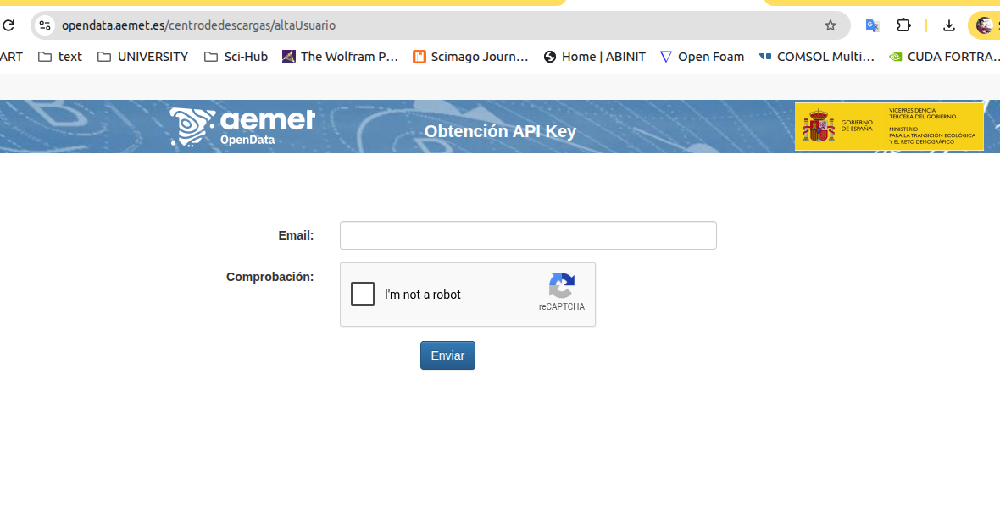
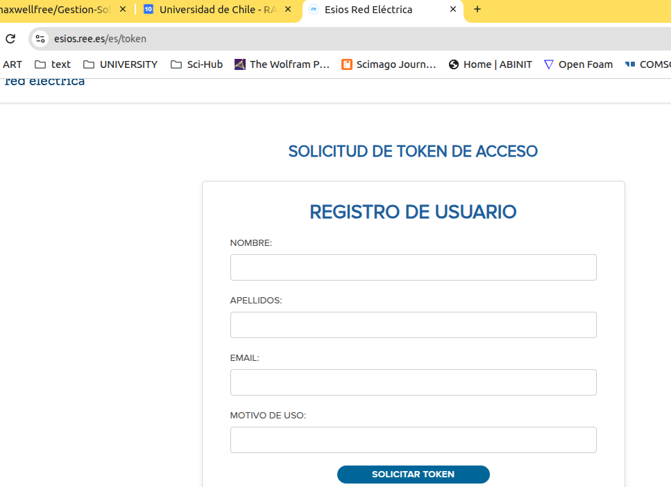

# Configuración y credenciales

[← Arquitectura](ARCHITECTURE.md) · **Configuración y credenciales** ·
[Fuentes de datos →](DATA_SOURCES.md)

------------------------------------------------------------------------

## 1. Propósito

Este documento define cómo la aplicación Android debe recopilar,
validar, almacenar y entregar al motor Python la información necesaria
para ejecutar **Gestión Solar Predictiva**.

El objetivo es sustituir la configuración manual del proyecto Python por
un asistente Android sencillo y reproducible.

El usuario no debería tener que:

``` text
editar config.yaml
modificar config.py
introducir claves en el código
editar demand.py
abrir un terminal
```

La aplicación debe transformar formularios comprensibles en la
configuración estructurada que necesite el motor.

La configuración se divide en dos categorías:

``` text
CONFIGURACIÓN FUNCIONAL
ubicación · FV · inversor · batería · vivienda · cargas · estrategia

CREDENCIALES / SECRETOS
AEMET API Key · ESIOS token
```

Esta separación es importante porque los secretos requieren un
tratamiento de seguridad diferente.

------------------------------------------------------------------------

## 2. Flujo de onboarding

La primera ejecución debería utilizar un asistente por pasos:

``` text
┌─────────────────────────┐
│ 1. Bienvenida           │
└────────────┬────────────┘
             ▼
┌─────────────────────────┐
│ 2. Credenciales         │
│ AEMET + ESIOS           │
└────────────┬────────────┘
             ▼
┌─────────────────────────┐
│ 3. Ubicación            │
└────────────┬────────────┘
             ▼
┌─────────────────────────┐
│ 4. Sistema fotovoltaico │
└────────────┬────────────┘
             ▼
┌─────────────────────────┐
│ 5. Inversor             │
└────────────┬────────────┘
             ▼
┌─────────────────────────┐
│ 6. Batería              │
└────────────┬────────────┘
             ▼
┌─────────────────────────┐
│ 7. Vivienda y cargas    │
└────────────┬────────────┘
             ▼
┌─────────────────────────┐
│ 8. Estrategia           │
└────────────┬────────────┘
             ▼
┌─────────────────────────┐
│ 9. Resumen / validación │
└────────────┬────────────┘
             ▼
┌─────────────────────────┐
│ 10. Primer cálculo      │
└─────────────────────────┘
```

El usuario debe poder volver atrás sin perder los datos ya introducidos.

------------------------------------------------------------------------

## 3. Credencial AEMET

El motor utiliza AEMET OpenData para obtener información meteorológica.

La credencial no debe incluirse en el repositorio. Cada usuario debe
introducir su propia API Key.

### Obtención de la API Key

La documentación visual incluida en el proyecto muestra la página
utilizada para solicitar la clave:



En la aplicación Android, la pantalla puede presentar:

``` text
AEMET OpenData

API Key
[________________________________]

[ Validar ]

¿No tienes una clave?
Consulta las instrucciones para obtenerla.
```

### Estado de validación

La interfaz debería distinguir:

``` text
No configurada
Validando...
Válida
No válida
Error de conexión
```

No debe considerarse válida una credencial únicamente porque el campo no
esté vacío.

------------------------------------------------------------------------

## 4. Token ESIOS

ESIOS / Red Eléctrica proporciona los datos económicos utilizados por el
proyecto.

La documentación del proyecto incluye la pantalla de solicitud del
token:



Pantalla conceptual:

``` text
ESIOS

Token personal
[________________________________]

[ Validar ]

El token se utilizará para consultar los datos
necesarios para la planificación energética.
```

Estados:

``` text
No configurado
Validando...
Válido
No válido
Error de conexión
```

AEMET y ESIOS deben tratarse como credenciales independientes: una puede
ser válida aunque la otra falle.

------------------------------------------------------------------------

## 5. Pantalla conjunta de credenciales

Para el MVP puede utilizarse una única pantalla:

``` text
┌────────────────────────────────────┐
│ Credenciales                       │
│                                    │
│ AEMET OpenData                     │
│ API Key                            │
│ [••••••••••••••••••••••••]       │
│ [VALIDAR]              ✓ Válida    │
│                                    │
│ ESIOS                              │
│ Token                              │
│ [••••••••••••••••••••••••]       │
│ [VALIDAR]              ✓ Válido    │
│                                    │
│              [CONTINUAR]           │
└────────────────────────────────────┘
```

Conviene permitir mostrar/ocultar temporalmente el valor mediante un
icono de visibilidad.

Por defecto debe aparecer oculto.

------------------------------------------------------------------------

## 6. Seguridad de las credenciales

### Nunca deben almacenarse en

``` text
Git
GitHub
BuildConfig
strings.xml
const val
configuración de ejemplo
capturas de logs
mensajes de error
analytics
```

Tampoco deben imprimirse desde Python:

``` python
# NO
print(f"AEMET key: {api_key}")
print(f"ESIOS token: {token}")
```

### Principio de almacenamiento

La capa Android debe tratar las credenciales como secretos locales.

Conceptualmente:

``` text
UI
 ↓
CredentialRepository
 ↓
almacenamiento protegido Android
```

Interfaz Kotlin:

``` kotlin
interface CredentialRepository {

    suspend fun saveAemetKey(value: String)

    suspend fun saveEsiosToken(value: String)

    suspend fun getAemetKey(): String?

    suspend fun getEsiosToken(): String?

    suspend fun clearCredentials()
}
```

La tecnología concreta de almacenamiento seguro debe seleccionarse de
acuerdo con las APIs Android vigentes y la versión mínima finalmente
soportada.

El resto de la aplicación no debería conocer cómo se cifran o almacenan
físicamente.

------------------------------------------------------------------------

## 7. Paso de secretos a Python

Las credenciales deben permanecer en memoria únicamente el tiempo
necesario para ejecutar las consultas.

Flujo conceptual:

``` text
almacenamiento protegido
        ↓
CredentialRepository
        ↓
PythonGateway
        ↓
android_adapter.py
        ↓
aemet.py / esios.py
```

No debería ser necesario escribir las claves en un archivo permanente
legible para que Python pueda utilizarlas.

Una posible entrada conceptual:

``` python
credentials = {
    "aemet_api_key": "...",
    "esios_token": "..."
}
```

y:

``` python
run_plan(
    config=config,
    credentials=credentials,
    soc=0.62,
    refresh=False,
)
```

Esto es una propuesta arquitectónica. Debe adaptarse a la forma real en
que `aemet.py` y `esios.py` reciben actualmente las credenciales.

------------------------------------------------------------------------

## 8. Ubicación

La ubicación es necesaria para asociar meteorología y producción
fotovoltaica a la instalación.

Campos iniciales previstos:

``` text
País
Provincia / región
Municipio
Latitud
Longitud
```

No todos tienen por qué ser editables simultáneamente.

Una estrategia razonable para el MVP es:

``` text
Municipio
   ↓
resolver/coherencia de localización
   ↓
latitud + longitud
```

La documentación disponible no fija todavía el mecanismo exacto de
geocodificación. No debe implementarse uno arbitrariamente sin comprobar
primero qué identificadores requieren AEMET y PVGIS.

### Modelo conceptual

``` kotlin
data class LocationConfig(
    val country: String,
    val region: String?,
    val municipality: String,
    val latitude: Double,
    val longitude: Double
)
```

------------------------------------------------------------------------

## 9. Sistema fotovoltaico

La aplicación debe recoger los parámetros que realmente utiliza
`solar.py`.

La especificación actual identifica la instalación FV como una categoría
de configuración, pero el conjunto definitivo de campos debe obtenerse
del código Python real.

Campos típicos que **pueden** resultar necesarios:

``` text
potencia instalada
orientación / azimut
inclinación
pérdidas
localización
```

No deben añadirse parámetros a la interfaz únicamente porque PVGIS los
permita. Deben exponerse aquellos que el motor realmente necesite.

Modelo provisional:

``` kotlin
data class PvConfig(
    val installedPowerKw: Double,
    val azimuthDeg: Double?,
    val tiltDeg: Double?,
    val lossesPercent: Double?
)
```

Los campos opcionales deben revisarse contra `solar.py`.

------------------------------------------------------------------------

## 10. Inversor

La configuración del inversor debe limitarse inicialmente a los
parámetros necesarios para los cálculos.

Ejemplo de pantalla:

``` text
Inversor

Potencia nominal
[ ______ ] kW

Potencia máxima de carga
[ ______ ] kW

Potencia máxima de descarga
[ ______ ] kW
```

Estos campos son ilustrativos. La interfaz definitiva debe derivarse de
`config.yaml`, `config.py`, `dispatch.py` y los demás módulos que
utilicen características del inversor.

No se pretende controlar el inversor en el MVP.

------------------------------------------------------------------------

## 11. Batería

La batería es especialmente importante porque el motor necesita conocer
tanto parámetros persistentes como el estado actual.

### Datos persistentes

Pueden incluir, si el motor los utiliza:

``` text
capacidad
SOC mínimo
SOC máximo
potencia máxima de carga
potencia máxima de descarga
eficiencias
```

### Dato variable

``` text
SOC actual
```

El SOC actual no debe confundirse con la configuración permanente.

Conceptualmente:

``` kotlin
data class BatteryConfig(
    val capacityKwh: Double,
    val minSoc: Double,
    val maxSoc: Double,
    val maxChargeKw: Double?,
    val maxDischargeKw: Double?
)
```

y separadamente:

``` kotlin
data class RuntimeState(
    val soc: Double
)
```

Esta separación será útil si en el futuro el SOC se obtiene
automáticamente del inversor.

------------------------------------------------------------------------

## 12. Validación del SOC

Internamente conviene utilizar una única convención.

Recomendación:

``` text
UI:      62 %
dominio: 0.62
Python:  0.62
```

Ejemplo:

``` kotlin
fun percentToSoc(percent: Int): Double {
    require(percent in 0..100)
    return percent / 100.0
}
```

Python:

``` python
def validate_soc(soc: float) -> None:
    if not 0.0 <= soc <= 1.0:
        raise ValueError("SOC must be between 0.0 and 1.0")
```

Los límites operativos reales de batería son otra cuestión: deben venir
de la configuración (`min_soc`, `max_soc`) y no confundirse con la
validación matemática del dato.

------------------------------------------------------------------------

## 13. Vivienda

La aplicación debe permitir caracterizar la demanda sin obligar a editar
`demand.py`.

La especificación actual contempla:

``` text
vivienda
perfil de consumo
cargas
presencia
flexibilidad
```

La pantalla debe traducir conceptos técnicos a preguntas comprensibles.

Por ejemplo:

``` text
Vivienda

Consumo base aproximado
[ ______ ] W

¿Hay consumo durante la noche?
[ Sí / No ]

¿La vivienda suele estar ocupada durante el día?
[ Sí / No ]
```

Este ejemplo no define todavía el modelo definitivo. Los campos deben
alinearse con la estructura real de `demand.py`.

------------------------------------------------------------------------

## 14. Cargas

Las cargas flexibles son fundamentales para convertir una previsión en
una recomendación útil.

Modelo conceptual:

``` kotlin
data class FlexibleLoad(
    val id: String,
    val name: String,
    val powerKw: Double,
    val durationMinutes: Int,
    val flexible: Boolean
)
```

Puede ser necesario añadir:

``` text
ventana horaria permitida
días permitidos
prioridad
energía requerida
fecha límite
interrumpible / no interrumpible
```

pero únicamente si el optimizador actual utiliza esos conceptos.

### Ejemplo visual

``` text
Lavadora

Potencia          2.0 kW
Duración          90 min
Flexible          Sí
Franja permitida  09:00–20:00

[GUARDAR]
```

------------------------------------------------------------------------

## 15. Estrategia

La especificación existente contempla una estrategia denominada:

``` text
sustainable_predictiva
```

Android debe presentar nombres comprensibles para el usuario, aunque
Python conserve identificadores internos estables.

Ejemplo:

``` text
Interfaz:
Gestión predictiva sostenible

Valor interno:
sustainable_predictiva
```

Esto evita acoplar los textos visibles a los identificadores del motor.

Modelo:

``` kotlin
enum class EnergyStrategy(
    val engineValue: String
) {
    SUSTAINABLE_PREDICTIVE(
        "sustainable_predictiva"
    )
}
```

Si el motor incorpora nuevas estrategias, se añadirán después de definir
con precisión sus diferencias.

------------------------------------------------------------------------

## 16. Modelo agregado de configuración

La capa Android puede trabajar con un modelo de dominio único:

``` kotlin
data class InstallationConfig(
    val location: LocationConfig,
    val pv: PvConfig,
    val inverter: InverterConfig,
    val battery: BatteryConfig,
    val household: HouseholdConfig,
    val loads: List<FlexibleLoad>,
    val strategy: EnergyStrategy
)
```

Las clases `InverterConfig` y `HouseholdConfig` deben concretarse tras
revisar los campos reales del motor.

Este modelo no tiene por qué coincidir exactamente con `config.yaml`. Un
mapper puede realizar la traducción:

``` text
InstallationConfig
        ↓
ConfigMapper
        ↓
estructura Python / YAML
```

------------------------------------------------------------------------

## 17. Separar configuración de ejecución

Es importante no mezclar datos que cambian raramente con datos de cada
cálculo.

### Configuración persistente

``` text
ubicación
FV
inversor
batería
vivienda
cargas
estrategia
```

### Estado de ejecución

``` text
SOC actual
refresh
fecha solicitada
horizonte
```

Modelo:

``` kotlin
data class PlanExecutionRequest(
    val soc: Double,
    val refresh: Boolean = false,
    val horizonDays: Int = 7
)
```

Esto permite recalcular muchas veces sin reconstruir toda la
instalación.

------------------------------------------------------------------------

## 18. Validación en dos niveles

### Android

Debe detectar errores inmediatos:

``` text
campo obligatorio vacío
número no válido
porcentaje fuera de rango
latitud imposible
SOC > 100 %
capacidad negativa
```

### Python

Debe volver a validar los datos antes del cálculo.

Nunca debe suponerse que una entrada es correcta únicamente porque pasó
por Android.

Flujo:

``` text
Formulario
   ↓
validación UI
   ↓
modelo Kotlin
   ↓
mapper
   ↓
Python
   ↓
validación de dominio
   ↓
cálculo
```

------------------------------------------------------------------------

## 19. Estado del onboarding

Conviene mantener un único estado para el asistente.

``` kotlin
data class OnboardingUiState(
    val aemetConfigured: Boolean = false,
    val esiosConfigured: Boolean = false,
    val locationComplete: Boolean = false,
    val pvComplete: Boolean = false,
    val inverterComplete: Boolean = false,
    val batteryComplete: Boolean = false,
    val householdComplete: Boolean = false,
    val loadsComplete: Boolean = false,
    val strategyComplete: Boolean = false
)
```

Puede calcularse:

``` kotlin
val OnboardingUiState.canFinish: Boolean
    get() =
        aemetConfigured &&
        esiosConfigured &&
        locationComplete &&
        pvComplete &&
        inverterComplete &&
        batteryComplete &&
        householdComplete &&
        loadsComplete &&
        strategyComplete
```

Si posteriormente alguna fuente pasa a ser opcional, esta condición
deberá modificarse.

------------------------------------------------------------------------

## 20. Validación de credenciales

La validación no debe ejecutar necesariamente todo el plan.

Es preferible disponer de operaciones pequeñas:

``` kotlin
interface CredentialValidator {
    suspend fun validateAemet(key: String): ValidationResult
    suspend fun validateEsios(token: String): ValidationResult
}
```

Resultado:

``` kotlin
sealed interface ValidationResult {
    data object Valid : ValidationResult
    data class Invalid(val reason: String) : ValidationResult
    data class NetworkError(val reason: String) : ValidationResult
}
```

El adaptador Python podría exponer funciones equivalentes si la lógica
de conexión ya está implementada allí.

------------------------------------------------------------------------

## 21. No confundir autenticación con disponibilidad

Una consulta puede fallar aunque la credencial sea correcta.

Ejemplos:

``` text
token incorrecto          → credencial inválida
servidor no disponible    → error temporal
sin conexión              → error de red
timeout                    → error temporal
respuesta inesperada      → error de servicio
```

La UI debe evitar mensajes como:

``` text
"Token incorrecto"
```

cuando realmente no ha podido contactar con el servicio.

------------------------------------------------------------------------

## 22. Configuración incompleta

Si falta información crítica, el cálculo no debe comenzar.

Ejemplo:

``` text
No se puede generar el plan todavía.

Falta:
• ubicación
• capacidad de batería
• credencial AEMET
```

La aplicación debe llevar al usuario directamente al apartado
correspondiente.

------------------------------------------------------------------------

## 23. Edición posterior

El onboarding se realiza una vez, pero toda la configuración debe
permanecer accesible desde **Ajustes**.

``` text
Ajustes
├── Credenciales
├── Ubicación
├── Sistema fotovoltaico
├── Inversor
├── Batería
├── Vivienda
├── Cargas
└── Estrategia
```

Cambiar una configuración relevante debe invalidar, cuando corresponda,
resultados calculados con la configuración anterior.

------------------------------------------------------------------------

## 24. Exportación e importación

No es requisito del MVP, pero la arquitectura debe permitir en el futuro
exportar la **configuración no sensible**.

Ejemplo:

``` json
{
  "location": {},
  "pv": {},
  "inverter": {},
  "battery": {},
  "household": {},
  "loads": [],
  "strategy": "sustainable_predictiva"
}
```

Las credenciales deben excluirse por defecto.

``` text
EXPORTABLE:
configuración técnica

NO EXPORTABLE POR DEFECTO:
AEMET API Key
ESIOS token
```

------------------------------------------------------------------------

## 25. Logs

Los logs son útiles durante el desarrollo, pero deben sanitizarse.

Incorrecto:

``` kotlin
Log.d("AEMET", "key=$aemetKey")
Log.d("ESIOS", "token=$esiosToken")
```

Correcto:

``` kotlin
Log.d("AEMET", "Credential configured")
Log.d("ESIOS", "Credential validation failed")
```

Python debe aplicar la misma regla.

------------------------------------------------------------------------

## 26. Configuración de ejemplo para tests

Los tests no deben necesitar credenciales reales.

Puede utilizarse:

``` text
fixtures/
mock responses/
fake gateways/
sample configuration/
```

Ejemplo de configuración ficticia:

``` json
{
  "location": {
    "latitude": 40.0,
    "longitude": -3.0
  },
  "pv": {
    "installed_power_kw": 5.0
  },
  "battery": {
    "capacity_kwh": 10.0,
    "min_soc": 0.20,
    "max_soc": 0.90
  },
  "strategy": "sustainable_predictiva"
}
```

Estos valores son únicamente datos de prueba y no representan una
instalación recomendada.

------------------------------------------------------------------------

## 27. Criterio de finalización del onboarding

Esta parte del MVP puede considerarse terminada cuando un usuario nuevo
puede:

1.  instalar la aplicación;
2.  introducir AEMET y ESIOS;
3.  validar ambas credenciales distinguiendo fallos de autenticación y
    red;
4.  configurar ubicación;
5.  configurar FV, inversor y batería;
6.  configurar vivienda y cargas;
7.  seleccionar la estrategia;
8.  cerrar y volver a abrir la aplicación sin perder la configuración;
9.  introducir el SOC actual;
10. iniciar un cálculo sin editar archivos ni código.

------------------------------------------------------------------------

## 28. Trabajo previo a fijar los campos definitivos

Antes de implementar todos los formularios debe realizarse una revisión
del motor Python para construir una tabla de correspondencia real:

``` text
CAMPO ANDROID
     ↓
MODELO KOTLIN
     ↓
CAMPO CONFIG / DEMAND
     ↓
MÓDULO PYTHON QUE LO UTILIZA
     ↓
UNIDAD / RANGO / OBLIGATORIEDAD
```

Ejemplo de plantilla:

  ------------------------------------------------------------------------------------
  Campo Android Destino Python                    Unidad Obligatorio   Validación
  ------------- ---------------------- ----------------- ------------- ---------------
  SOC actual    `run_plan(..., soc)`                0--1 Sí            `0 ≤ SOC ≤ 1`

  Potencia FV   por determinar                        kW por           `> 0`
                                                         determinar    

  Capacidad     por determinar                       kWh por           `> 0`
  batería                                                determinar    

  AEMET API Key `aemet.py` / por                 secreto Sí\*          validación API
                verificar                                              

  ESIOS token   `esios.py` / por                 secreto Sí\*          validación API
                verificar                                              
  ------------------------------------------------------------------------------------

`*` La obligatoriedad exacta debe confirmarse según el comportamiento
del motor y la posibilidad de funcionar con caché.

Esta tabla debe completarse **a partir del código real**, no de
supuestos de interfaz.

------------------------------------------------------------------------

## 29. Navegación

[← Arquitectura](ARCHITECTURE.md) · **Configuración y credenciales** ·
[Fuentes de datos →](DATA_SOURCES.md)

También: [README](../README.md) · [UI / MVP](UI_MVP.md) · [Plan de
desarrollo](DEVELOPMENT_PLAN.md)
