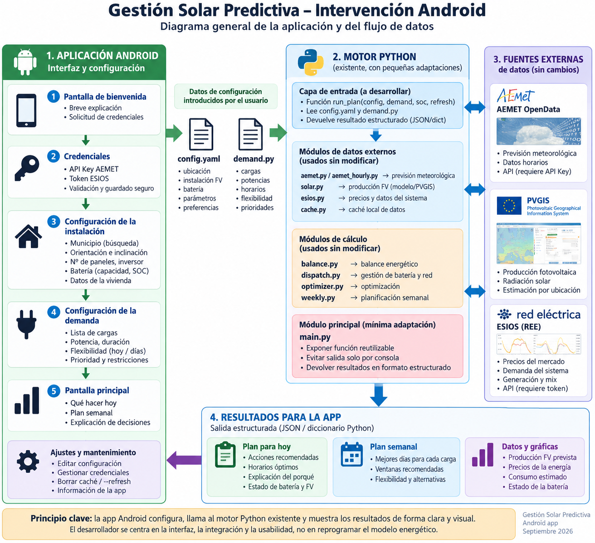

# Plan de desarrollo --- Android

[← UI / MVP](UI_MVP.md) · **Plan de desarrollo** ·
[README](../README.md)

------------------------------------------------------------------------

## 1. Objetivo

Este documento convierte la arquitectura y la especificación funcional
de **Gestión Solar Predictiva** en una secuencia de trabajo para la
rama:

``` text
android-app
```

El objetivo no es construir toda la aplicación de una vez. El desarrollo
debe avanzar mediante **hitos verticales verificables**, empezando por
la incertidumbre técnica principal:

> **¿Puede Android ejecutar de forma fiable el motor Python existente,
> pasarle datos y recibir un resultado estructurado?**

Solo después de demostrar ese recorrido debe invertirse esfuerzo
importante en la interfaz definitiva.

La secuencia general será:

``` text
FASE 0  Auditoría del motor existente
   ↓
FASE 1  Prueba Android ↔ Python
   ↓
FASE 2  Contrato estable y adaptador
   ↓
FASE 3  Configuración / onboarding
   ↓
FASE 4  Pantalla «Hoy»
   ↓
FASE 5  Explicabilidad
   ↓
FASE 6  Plan semanal
   ↓
FASE 7  Energía / caché / robustez
   ↓
FASE 8  Tests y endurecimiento
   ↓
FASE 9  APK reproducible
```

------------------------------------------------------------------------

# 2. Regla de trabajo

Cada fase debe terminar con algo que pueda probarse.

No:

``` text
"arquitectura casi terminada"
```

Sí:

``` text
"Android ejecuta una función Python y muestra el resultado"
```

No:

``` text
"onboarding avanzado"
```

Sí:

``` text
"la configuración persiste después de cerrar y abrir la app"
```

No:

``` text
"gestión de errores implementada"
```

Sí:

``` text
"una credencial AEMET inválida produce un estado de autenticación
controlado y permite ir a Ajustes"
```

------------------------------------------------------------------------

# 3. Documentación de referencia

Antes de modificar una capa, consultar:

  ----------------------------------------------------------------------------------------------------------
  Tema                                Documento
  ----------------------------------- ----------------------------------------------------------------------
  visión general                      [README.md](../README.md)

  Android ↔ Python                    [ARCHITECTURE.md](ARCHITECTURE.md)

  configuración y secretos            [CONFIGURATION_AND_CREDENTIALS.md](CONFIGURATION_AND_CREDENTIALS.md)

  AEMET / PVGIS / ESIOS               [DATA_SOURCES.md](DATA_SOURCES.md)

  pantallas y UX                      [UI_MVP.md](UI_MVP.md)
  ----------------------------------------------------------------------------------------------------------



------------------------------------------------------------------------

# 4. Antes de programar: inventario del repositorio

La primera tarea no es escribir Kotlin.

Debe inspeccionarse el motor Python y documentar:

``` text
punto de entrada actual
configuración
dependencias
entradas
salidas
efectos laterales
archivos escritos
red
caché
errores
```

## 4.1 Archivos a revisar

Según la especificación disponible:

``` text
main.py
config.py
config.yaml
demand.py

aemet.py
aemet_hourly.py
solar.py
esios.py
cache.py

balance.py
dispatch.py
optimizer.py
weekly.py
```

## 4.2 Preguntas que deben quedar respondidas

``` text
¿Qué función inicia actualmente un cálculo?
¿Qué recibe?
¿Qué devuelve?
¿Qué imprime?
¿Qué archivos lee?
¿Qué archivos escribe?
¿Qué variables globales utiliza?
¿Cómo recibe AEMET la API Key?
¿Cómo recibe ESIOS el token?
¿Qué dependencias Python necesita?
¿Cuáles tienen código nativo?
¿Cómo funciona cache.py?
¿Qué estructura produce weekly.py?
¿Qué datos necesita optimizer.py?
```

No debe diseñarse el contrato Android definitivo antes de responder
estas preguntas.

------------------------------------------------------------------------

# 5. Entregable 0 --- `ENGINE_INVENTORY.md`

Aunque no es obligatorio para ejecutar la app, resulta recomendable
crear:

``` text
docs/ENGINE_INVENTORY.md
```

con una tabla como:

  -----------------------------------------------------------------------------------------
  Módulo           Entrada    Salida     Red         Disco      Dependencias   Android
  ---------------- ---------- ---------- ----------- ---------- -------------- ------------
  `aemet.py`       por        por        Sí          por        por revisar    reutilizar
                   revisar    revisar                revisar                   

  `solar.py`       por        por        por revisar por        por revisar    reutilizar
                   revisar    revisar                revisar                   

  `optimizer.py`   por        por        No /        por        por revisar    reutilizar
                   revisar    revisar    verificar   revisar                   
  -----------------------------------------------------------------------------------------

Esto reducirá supuestos durante la integración.

------------------------------------------------------------------------

# 6. Fase 1 --- Crear el proyecto Android mínimo

## Objetivo

Conseguir una aplicación Android que compile y arranque antes de
integrar el motor.

Tecnología prevista:

``` text
Kotlin
Jetpack Compose
ViewModel
Coroutines
```

## Resultado mínimo

Una pantalla:

``` text
GESTIÓN SOLAR PREDICTIVA

Android ↔ Python test

SOC
[ 60 ]

[ RUN PYTHON ]

Status:
Not executed
```

Todavía puede no existir Python.

## Criterio de aceptación

``` text
✓ proyecto abre en Android Studio
✓ Gradle sincroniza
✓ compila
✓ APK debug se genera
✓ aplicación arranca
✓ pantalla de diagnóstico visible
```

No continuar si el proyecto base no es reproducible.

------------------------------------------------------------------------

# 7. Estructura Android inicial

Propuesta:

``` text
app/
└── src/main/
    ├── java/.../
    │   ├── ui/
    │   │   └── diagnostic/
    │   │
    │   ├── data/
    │   │   └── repository/
    │   │
    │   └── integration/
    │       └── python/
    │
    └── python/
```

No es necesario crear desde el primer commit todos los paquetes futuros.

El árbol debe crecer cuando aparezcan responsabilidades reales.

------------------------------------------------------------------------

# 8. Fase 2 --- Prueba mínima Python

## Objetivo

Demostrar la ejecución de Python desde Android antes de introducir el
motor completo.

Función Python de prueba:

``` python
def hello_android(value: int) -> dict:
    return {
        "status": "ok",
        "input": value,
        "result": value * 2
    }
```

Android debe:

``` text
introducir 60
   ↓
llamar Python
   ↓
recibir dict/estructura
   ↓
mostrar 120
```

Este test separa:

``` text
problema de integración Android–Python
```

de:

``` text
problema del motor energético
```

## Criterio de aceptación

``` text
✓ Python se empaqueta
✓ Android invoca Python
✓ se pasan argumentos
✓ se recibe una estructura
✓ Kotlin interpreta la respuesta
✓ una excepción Python no cierra la app
```

------------------------------------------------------------------------

# 9. Punto de decisión crítico: tecnología Python--Android

La tecnología concreta debe validarse experimentalmente.

No debe elegirse solo porque un ejemplo sencillo funcione.

Debe comprobarse:

``` text
versión Python
dependencias del proyecto
bibliotecas con código nativo
arquitectura ARM64
acceso HTTP
TLS
sistema de archivos
tamaño APK
tiempo de arranque
compilación release
```

## Prueba obligatoria

Después de `hello_android`, importar progresivamente las dependencias
reales.

Por ejemplo:

``` python
def dependency_test():
    imports = {}

    try:
        import requests
        imports["requests"] = "ok"
    except Exception as exc:
        imports["requests"] = repr(exc)

    # Añadir aquí las dependencias REALES
    # encontradas durante el inventario.

    return imports
```

No inventar la lista de dependencias: debe obtenerse del repositorio.

------------------------------------------------------------------------

# 10. Fase 3 --- Crear `android_adapter.py`

Una vez demostrada la integración, crear una frontera estable:

``` text
android_adapter.py
```

Responsabilidades:

``` text
recibir datos de Android
validar entrada
adaptar configuración
invocar motor existente
capturar errores esperables
normalizar salida
devolver estructura
```

No debe:

``` text
contener UI
duplicar optimizer.py
duplicar balance.py
reescribir solar.py
```

------------------------------------------------------------------------

# 11. Primera API del adaptador

Objetivo conceptual:

``` python
def run_plan(
    config,
    soc: float,
    refresh: bool = False
) -> dict:
    ...
```

Si las credenciales deben suministrarse explícitamente:

``` python
def run_plan(
    config,
    credentials,
    soc: float,
    refresh: bool = False
) -> dict:
    ...
```

La firma definitiva se decidirá tras revisar el motor.

## Criterio de aceptación

La misma función debe poder probarse primero desde Python:

``` python
result = run_plan(
    config=test_config,
    soc=0.60,
    refresh=False
)

assert isinstance(result, dict)
assert "status" in result
```

y después desde Android.

------------------------------------------------------------------------

# 12. Fase 4 --- Contrato de salida

Antes de desarrollar «Hoy», estabilizar una primera versión del
contrato.

Propuesta:

``` json
{
  "status": "ok",
  "warnings": [],
  "updated_at": "...",
  "cache_status": "...",
  "forecast": {},
  "demand": {},
  "energy": {},
  "today_actions": [],
  "weekly_plan": []
}
```

No todos los campos tienen que existir en la primera iteración.

Es mejor empezar con:

``` json
{
  "status": "ok",
  "today_actions": []
}
```

y ampliar de forma controlada.

------------------------------------------------------------------------

# 13. Versionado del contrato

Cuando Android dependa del esquema, conviene incluir una versión:

``` json
{
  "schema_version": 1,
  "status": "ok"
}
```

Esto permite detectar incompatibilidades en el futuro.

Kotlin:

``` kotlin
data class PlanResultDto(
    val schemaVersion: Int,
    val status: String,
    val warnings: List<String>,
    val todayActions: List<TodayActionDto>
)
```

No es necesario diseñar ahora un sistema complejo de migraciones; basta
con evitar un contrato implícito imposible de identificar.

------------------------------------------------------------------------

# 14. Fase 5 --- `PythonGateway`

Crear la interfaz Android:

``` kotlin
interface PythonGateway {
    suspend fun runPlan(
        request: PlanRequest
    ): PlanResultDto
}
```

Implementación:

``` text
EmbeddedPythonGateway
```

Responsabilidad:

``` text
Kotlin request
     ↓
tipos aceptados por integración
     ↓
Python
     ↓
respuesta
     ↓
mapper
     ↓
PlanResultDto
```

## Criterio de aceptación

Un test o pantalla diagnóstica debe demostrar:

``` text
PlanRequest(soc = 0.60)
       ↓
PythonGateway
       ↓
android_adapter.py
       ↓
motor
       ↓
PlanResultDto
```

------------------------------------------------------------------------

# 15. Fase 6 --- Gestión de errores

Antes del onboarding completo, establecer categorías de error.

Ejemplo conceptual:

``` text
CONFIGURATION_ERROR
AUTHENTICATION_ERROR
NETWORK_ERROR
SERVICE_UNAVAILABLE
INVALID_RESPONSE
ENGINE_ERROR
```

Kotlin:

``` kotlin
sealed interface AppError {

    data class Authentication(
        val source: String
    ) : AppError

    data class Network(
        val source: String?
    ) : AppError

    data class Configuration(
        val field: String?
    ) : AppError

    data class Engine(
        val message: String
    ) : AppError
}
```

La UI nunca debe depender de buscar palabras dentro de un traceback.

------------------------------------------------------------------------

# 16. Fase 7 --- Persistencia de configuración

Implementar los modelos definidos en:

[CONFIGURATION_AND_CREDENTIALS.md](CONFIGURATION_AND_CREDENTIALS.md)

Separar:

``` text
CONFIGURACIÓN
```

de:

``` text
SECRETOS
```

Crear interfaces:

``` kotlin
interface ConfigurationRepository {
    suspend fun load(): InstallationConfig?
    suspend fun save(config: InstallationConfig)
}

interface CredentialRepository {
    suspend fun getAemetKey(): String?
    suspend fun getEsiosToken(): String?
    suspend fun saveAemetKey(value: String)
    suspend fun saveEsiosToken(value: String)
}
```

## Criterio de aceptación

``` text
✓ configurar
✓ cerrar app
✓ volver a abrir
✓ configuración sigue disponible
✓ secretos no aparecen en logs
```

------------------------------------------------------------------------

# 17. Fase 8 --- Validación de credenciales

Implementar validación independiente.

``` text
AEMET
[VALIDAR]
   ↓
Validando
   ↓
Válida / inválida / error de red
```

y lo mismo para ESIOS.

Debe diferenciarse:

``` text
credencial incorrecta
```

de:

``` text
servidor no disponible
```

## Criterio de aceptación

Probar:

``` text
credencial válida
credencial inválida
sin Internet
timeout
servicio no disponible
```

------------------------------------------------------------------------

# 18. Fase 9 --- Onboarding

Construir el asistente:

``` text
Credenciales
Ubicación
FV
Inversor
Batería
Vivienda
Cargas
Estrategia
Resumen
```

No deben fijarse campos definitivos antes de completar la
correspondencia con `config.py`, `config.yaml` y `demand.py`.

## Entregable

Un usuario puede completar la configuración sin:

``` text
terminal
editor de texto
modificar Python
editar YAML manualmente
```

------------------------------------------------------------------------

# 19. Fase 10 --- Mapper Android → motor

Crear explícitamente la traducción:

``` text
InstallationConfig
        ↓
EngineConfigMapper
        ↓
config esperado por Python
```

Ejemplo conceptual:

``` kotlin
class EngineConfigMapper {

    fun map(
        config: InstallationConfig
    ): Map<String, Any> {
        // Debe seguir el esquema REAL del motor.
        TODO()
    }
}
```

Si inicialmente se genera YAML:

``` text
InstallationConfig
       ↓
EngineConfigMapper
       ↓
config.yaml temporal
       ↓
config.py
```

El archivo temporal no debe contener secretos salvo que sea
estrictamente inevitable y esté protegido adecuadamente.

------------------------------------------------------------------------

# 20. Fase 11 --- Pantalla «Hoy»

Solo ahora construir la pantalla principal definitiva.

Componentes iniciales:

``` text
TodayScreen
RecommendationCard
DataFreshnessBanner
LoadingPanel
ErrorPanel
```

ViewModel:

``` text
TodayViewModel
```

Flujo:

``` text
TodayScreen
    ↓
TodayViewModel
    ↓
EnergyRepository
    ↓
PythonGateway
    ↓
run_plan()
```

## Criterio de aceptación

La pantalla debe representar:

``` text
Loading
Content
Error
Refreshing
Cached/Stale warning
```

------------------------------------------------------------------------

# 21. Fase 12 --- Explicabilidad

Una recomendación no está terminada si solo dice:

``` text
"Lavadora 13:00"
```

Debe poder responder:

``` text
¿POR QUÉ?
```

El motor debe devolver razones estructuradas siempre que sea posible.

Ejemplo:

``` json
{
  "action": "Lavadora",
  "start": "13:00",
  "reasons": [
    "HIGH_PV_FORECAST",
    "FLEXIBLE_LOAD"
  ]
}
```

Android traduce esos códigos a texto.

No debe recalcular la lógica para explicar una decisión.

------------------------------------------------------------------------

# 22. Fase 13 --- Plan semanal

Implementar:

``` text
WeekScreen
DayPlanCard
RecommendationCard
```

El resultado debe provenir de:

``` text
weekly.py
```

a través del adaptador.

## Criterio de aceptación

El usuario puede:

``` text
ver próximos días
ver acciones por día
abrir detalle
distinguir previsión de dato actual
```

------------------------------------------------------------------------

# 23. Fase 14 --- Pantalla «Energía»

Solo cuando el contrato proporcione datos suficientes.

Puede representar:

``` text
FV
demanda
SOC
red
excedente
precios
```

No debe reconstruir el balance.

## Criterio

Todo valor mostrado debe poder rastrearse a:

``` text
PlanResultDto
```

o a un modelo derivado puramente de presentación.

------------------------------------------------------------------------

# 24. Fase 15 --- Caché y actualización

Integrar el comportamiento descrito en
[DATA_SOURCES.md](DATA_SOURCES.md).

Estados:

``` text
UPDATED
CACHED
STALE
UNAVAILABLE
```

Botón:

``` text
Actualizar
```

debe activar:

``` text
refresh=True
```

## Criterio de aceptación

Probar:

``` text
online + caché
online + sin caché
offline + caché válida
offline + caché antigua
offline + sin datos
refresh forzado
```

------------------------------------------------------------------------

# 25. Fase 16 --- Tests

La aplicación debe tener tests en varias fronteras.

## Python

Probar:

``` text
validación de entrada
run_plan()
mapeo de errores
contrato de salida
```

Ejemplo:

``` python
def test_invalid_soc():
    try:
        run_plan(
            config={},
            soc=1.5,
            refresh=False
        )
    except ValueError:
        return

    raise AssertionError(
        "Expected ValueError for invalid SOC"
    )
```

Debe adaptarse a las excepciones reales finalmente definidas.

## Kotlin unit tests

Probar:

``` text
mappers
ViewModel
repositories
formatters
validaciones
```

## Integración

Probar:

``` text
Kotlin → Python → Kotlin
```

## UI

Probar al menos recorridos críticos:

``` text
onboarding
calcular plan
ver recomendación
abrir detalle
error de credencial
```

------------------------------------------------------------------------

# 26. `FakePythonGateway`

Debe existir pronto para desacoplar el desarrollo UI:

``` kotlin
class FakePythonGateway : PythonGateway {

    override suspend fun runPlan(
        request: PlanRequest
    ): PlanResultDto {
        return samplePlan()
    }
}
```

Esto permite:

``` text
David desarrolla UI
```

mientras:

``` text
se resuelven detalles del motor
```

sin duplicar la lógica energética.

------------------------------------------------------------------------

# 27. Fase 17 --- Pruebas de dispositivo real

El emulador no es suficiente.

Probar al menos:

``` text
instalación APK
arranque en frío
red Wi-Fi
red móvil si procede
sin conexión
reapertura
rotación si está permitida
background/foreground
actualización de datos
```

Especialmente importante:

``` text
Python embebido en ARM64
```

porque un prototipo que funciona en un entorno de desarrollo no
garantiza compatibilidad en dispositivos reales.

------------------------------------------------------------------------

# 28. Fase 18 --- Rendimiento

Medir antes de optimizar.

Registrar:

``` text
tiempo de arranque
tiempo de inicialización Python
tiempo de run_plan()
tiempo de APIs
tamaño APK
memoria
```

Separar:

``` text
tiempo de red
```

de:

``` text
tiempo de cálculo
```

para identificar cuellos de botella reales.

------------------------------------------------------------------------

# 29. Fase 19 --- Release APK

Objetivo inicial:

``` text
APK instalable
```

No es obligatorio publicar en Google Play.

Checklist:

``` text
✓ build release
✓ firma configurada fuera del repositorio
✓ sin credenciales reales
✓ sin logs sensibles
✓ versión definida
✓ instalación limpia
✓ onboarding completo
✓ cálculo completo
✓ manejo offline
✓ documentación actualizada
```

Nunca subir al repositorio:

``` text
keystore privado
contraseña de firma
API Keys
tokens
```

------------------------------------------------------------------------

# 30. Commits

Preferir commits pequeños y verificables.

Ejemplos:

``` text
Add Android project skeleton
Add Python bridge proof of concept
Add plan result DTO
Add AEMET credential validation
Add onboarding battery step
Add Today recommendation card
Handle cached data warning
```

Evitar commits genéricos:

``` text
changes
update
fix stuff
android work
```

------------------------------------------------------------------------

# 31. Pull Requests

Aunque el trabajo principal se realice en `android-app`, los cambios que
posteriormente deban incorporarse a `main` deben pasar por Pull Request.

Un PR debe indicar:

``` text
qué cambia
por qué
cómo probarlo
qué archivos Python modifica
si cambia el contrato
capturas si cambia UI
```

Si se modifica un algoritmo energético existente, debe indicarse
explícitamente.

------------------------------------------------------------------------

# 32. Archivos Python que deben tocarse con cautela

La especificación inicial establece que el núcleo debe reutilizarse:

``` text
balance.py
dispatch.py
optimizer.py
weekly.py
```

Por tanto, un cambio en estos archivos debe responder a una necesidad
real del motor, no a una comodidad de la UI.

Preferir:

``` text
android_adapter.py adapta el motor a Android
```

frente a:

``` text
optimizer.py cambia para adaptarse a una pantalla
```

------------------------------------------------------------------------

# 33. Qué puede modificar libremente la rama Android

En principio:

``` text
proyecto Android
UI Compose
ViewModels
repositories Android
mappers
persistencia Android
PythonGateway
android_adapter.py
tests Android
documentación Android
```

Siempre respetando la compatibilidad con el motor.

------------------------------------------------------------------------

# 34. Qué no debe hacerse

No:

``` text
reescribir todo Python en Kotlin
```

No:

``` text
duplicar reglas energéticas en ViewModel
```

No:

``` text
parsear print() de main.py
```

No:

``` text
subir credenciales
```

No:

``` text
construir todas las pantallas antes de probar Python
```

No:

``` text
añadir campos de configuración que el motor no utiliza
```

No:

``` text
suponer que una API externa siempre estará disponible
```

------------------------------------------------------------------------

# 35. Hitos de entrega

## Hito A --- Bridge

``` text
Android → Python → Android
```

**Resultado:** función Python de prueba ejecutada desde el dispositivo.

## Hito B --- Engine

``` text
Android → android_adapter.py → motor real → Android
```

**Resultado:** primera salida real estructurada.

## Hito C --- Configuration

``` text
onboarding → persistencia → config motor
```

**Resultado:** no es necesario editar archivos.

## Hito D --- Today

``` text
motor → recomendación → explicación
```

**Resultado:** primera versión realmente útil.

## Hito E --- Week

``` text
weekly.py → Android
```

**Resultado:** planificación multidiaria.

## Hito F --- Robustness

``` text
caché + offline + errores + tests
```

**Resultado:** aplicación utilizable fuera del entorno de desarrollo.

## Hito G --- APK

``` text
release reproducible
```

**Resultado:** APK instalable para pruebas externas.

------------------------------------------------------------------------

# 36. Dependencias entre tareas

No todas las tareas pueden hacerse en paralelo.

``` text
Inventario Python
      │
      ├─────────────┐
      ▼             ▼
Bridge Python    UI con FakeGateway
      │             │
      ▼             │
Adaptador real      │
      │             │
      ├─────────────┘
      ▼
Contrato estable
      │
      ├───────────────┐
      ▼               ▼
Onboarding           Hoy
      │               │
      └───────┬───────┘
              ▼
        Semana / Energía
              │
              ▼
       Robustez / Release
```

Esto permite avanzar en UI sin bloquearse, pero evita conectar la UI
definitiva a un contrato todavía inestable.

------------------------------------------------------------------------

# 37. Orden recomendado para David

Si se empieza desde cero en la rama `android-app`, el orden práctico es:

1.  leer `README.md` y `ARCHITECTURE.md`;
2.  revisar el motor Python y sus dependencias;
3.  crear el proyecto Android mínimo;
4.  demostrar Kotlin → Python → Kotlin;
5.  probar las dependencias reales del motor en Android;
6.  crear `android_adapter.py`;
7.  conseguir una salida real del motor;
8.  fijar DTOs y errores;
9.  implementar persistencia y credenciales;
10. construir onboarding;
11. construir «Hoy»;
12. añadir «¿Por qué?»;
13. añadir «Semana»;
14. añadir «Energía»;
15. completar caché/offline/tests;
16. generar APK release.

------------------------------------------------------------------------

# 38. Definición de terminado del MVP

El MVP no está terminado porque "compile".

Debe cumplirse el recorrido completo:

``` text
APK
 ↓
instalación
 ↓
onboarding
 ↓
credenciales
 ↓
configuración
 ↓
SOC
 ↓
AEMET / PVGIS / ESIOS
 ↓
motor Python
 ↓
plan estructurado
 ↓
Hoy
 ↓
¿Por qué?
 ↓
Semana
 ↓
cierre
 ↓
reapertura
```

Y además:

``` text
✓ sin editar código
✓ sin editar YAML manualmente
✓ sin credenciales en Git
✓ errores comprensibles
✓ caché controlada
✓ configuración persistente
✓ contrato Android–Python documentado
✓ motor energético no duplicado en Kotlin
```

------------------------------------------------------------------------

# 39. Primer trabajo concreto

La primera contribución de implementación debería ser deliberadamente
pequeña:

``` text
1. crear proyecto Android
2. añadir pantalla Android ↔ Python Test
3. integrar una función Python trivial
4. pasar un número desde Kotlin
5. devolver una estructura desde Python
6. mostrar el resultado
7. documentar cómo compilar y ejecutar
```

Solo después:

``` text
8. importar una dependencia real
9. importar un módulo real
10. ejecutar una función real del proyecto
```

Esta secuencia permite identificar pronto si existe algún bloqueo
tecnológico.

------------------------------------------------------------------------

# 40. Navegación

[← UI / MVP](UI_MVP.md) · **Plan de desarrollo** ·
[README](../README.md)

También: [Arquitectura](ARCHITECTURE.md) · [Configuración y
credenciales](CONFIGURATION_AND_CREDENTIALS.md) · [Fuentes de
datos](DATA_SOURCES.md)
